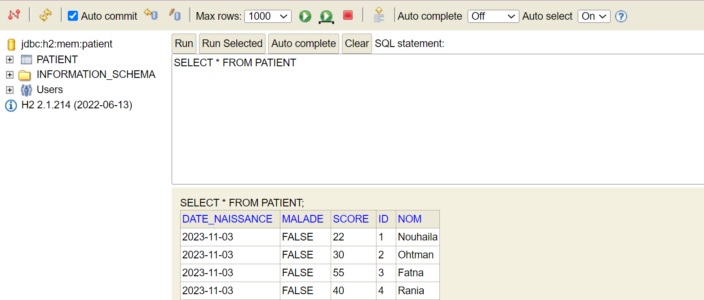
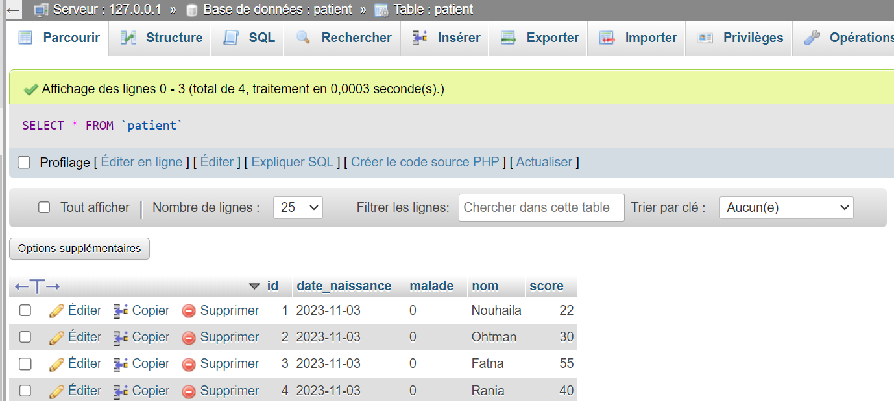
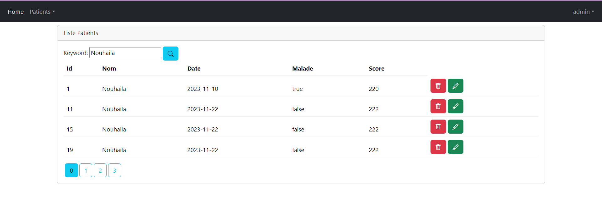

Realisée par : DANOUNI NOUHAILA

__________________________________________________________________________________________________________
<h1>Rapport de TP N° 3_4 : Projet Spring Boot avec Spring Security</h1>
<h2>Development Web JEE Spring MVC</h2>
<h2>Introduction</h2>

Ce rapport détaille le développement d'une application web sécurisée avec Spring Boot et Spring Security, axée sur la gestion des patients. Le processus englobe la création d'un projet avec les dépendances requises, l'implémentation des entités JPA pour les patients, la configuration de la persistance des données, la mise en place d'un contrôleur Spring MVC et la création de vues Thymeleaf. La flexibilité de connexion à H2 ou MySQL est une caractéristique clé du projet. La sécurité est renforcée par l'intégration de Spring Security avec trois stratégies d'authentification : InMemoryAuthentication, JdbcAuthentication, et UserDetailsService. L'objectif final est de fournir une application web opérationnelle, adaptable et sécurisée, en exploitant de manière judicieuse les fonctionnalités offertes par Spring Boot et Spring Security.

<h2>Ennoncé</h2>

Créer une application Web JEE basée sur Spring MVC, Thylemeaf et Spring Data JPA qui permet de gérer les patients. L'application doit permettre les fonctionnalités suivantes :

<ul>
<li>Stocker les patiens dans H2 DataBase puis dans MySQL</li>
<li>Afficher les patients</li>
<li>Faire la pagination</li>
<li>Chercher les patients</li>
<li>Ajouter un patient</li>
<li>Modifier un patient</li>
<li>Supprimer un patient</li>
<li>Sécuriser les données des utilisateurs</li>
<li>Gérer les droits d'accès</li>
</ul>
<h2>Objectifs</h2>
<ol>
<li>Créer un projet spring boot avec les dépendances Web, Spring Data JPA, H2,
Lombok, Thymeleaf</li>
<ul>
<li>Créer l'entité JPA Patient</li>
<li>Créer l'interface PatientRepository basée sur Spring Data</li>
<li>Configurer l'application pour se connecter soit à h2 Database ou à MySQL (application properties)</li>
<li>Créer le contrôleur Spring MVC</li>
<li>Créer les vues basées sur Thymeleaf</li>
</ul>
<li>Sécuriser cette application en intégrant un système d'authentification basé sur Spring security avec les trois stratégies: 
<ul>
<li>InMemoryAuthentication</li>
<li>JdbcAuthentication</li>
<li>UserDetailsService</li>
</ul>
</ol>
<h2>Architecture Spring MVC avec Thymeleaf</h2>

<h2>Conception</h2>

<h2>Réalisation</h2>
<ol>
<h3><li>Création du projet spring boot avec les dépendances Web, Spring Data JPA, H2,
Lombok, Thymeleaf qui sert à:</li></h3>
<ul>
<h4><li>Affichage des données des patients dans H2 DataBase et dans MySQL</li></h4>

<h4><li>Affichage des patients avec la pagination</li></h4>

<h4><li>Chercher les patients</li></h4>

<h4><li>Ajouter un patient</li></h4>

<h4><li>Modifier un patient</li></h4>

<h4><li>Supprimer un patient</li></h4>

J'ai supprimé dans ce cas le patient avec l'ID=38

</ul>
<h3>
<li>Sécuriser cette application en intégrant un système d'authentification basé sur Spring security avec les trois stratégies: 
</li>
</h3>
<ul>
<h4><li>Création de la classe SecurityConfig</li></h4>

<h5>Annotations utilisées :</h5>
<ul>
<li>
@Configuration : Indique que la classe est une configuration Spring, permettant la définition de beans et de configurations.
</li>
<li>
@EnableWebSecurity : Active la configuration de sécurité web de Spring Security.
</li>
<li>
@EnableMethodSecurity(prePostEnabled = true) : Active la sécurité basée sur les annotations pour les méthodes. prePostEnabled = true permet l'utilisation des annotations @PreAuthorize et @PostAuthorize pour définir des règles de sécurité au niveau des méthodes.
</li>
<li>
@AllArgsConstructor : Lombok génère automatiquement un constructeur qui prend tous les champs de la classe comme paramètres. Cela est utile pour l'injection de dépendances.
</li>
</ul>
<h5>Attributs utilisés :</h5>
<ul>
<li>
private PasswordEncoder passwordEncoder; : Un bean qui encode les mots de passe. Utilisé pour sécuriser les mots de passe stockés dans la base de données.
</li>
<li>
private UserDetailServiceImpl userDetailServiceImpl; : Un service personnalisé qui implémente l'interface UserDetailsService. Ce service est utilisé pour récupérer les détails de l'utilisateur, notamment lors de l'authentification.
</li>
</ul>
 

La classe SecurityConfig agit comme une configuration centralisée pour la sécurité de l'application Spring. Elle définit les stratégies d'authentification, les gestionnaires de détails d'utilisateurs, et configure la sécurité des requêtes HTTP. La classe utilise une combinaison de configurations en mémoire (InMemoryUserDetailsManager) et basées sur une base de données (JdbcUserDetailsManager). Elle spécifie également des règles d'autorisation pour certaines URL, la gestion des sessions, la redirection en cas d'erreurs d'accès, et elle configure le service UserDetailServiceImpl comme gestionnaire des détails d'utilisateur personnalisé. En résumé, elle orchestre l'ensemble des mécanismes de sécurité de l'application web.

<h4><li>InMemoryAuthentication dans SecurityConfig</li></h4>
<ul>
<li>
Définition : Cette stratégie d'authentification stocke les informations d'identification des utilisateurs en mémoire, généralement dans la configuration du code.
</li>
<li>
Dans le Code :</li>

<li>
Différence : Les détails des utilisateurs sont définis directement dans le code, et ils restent en mémoire pendant la durée de vie de l'application. Cette approche est souvent utilisée pour des utilisateurs statiques et dans des environnements de développement.
</li>

</ul>

<h4><li>JdbcAuthentication dans SecurityConfig</li></h4>
<ul>
<li>
Définition : Cette stratégie d'authentification utilise une base de données relationnelle (comme MySQL, PostgreSQL, etc.) pour stocker et récupérer les informations d'identification des utilisateurs.
</li>
<li>
Dans le Code :</li>

<li>
Différence : Les détails des utilisateurs sont stockés dans une base de données externe. Cela offre une solution plus évolutive pour la gestion des utilisateurs, particulièrement dans des environnements de production.
</li>
<li>
Dans la base de données:</li>

</ul>
<h4><li>UserDetailsService dans SecurityConfig</li></h4>
<ul>
<li>
Définition : Cette interface permet de récupérer les détails de l'utilisateur à partir de n'importe quelle source de données personnalisée, par exemple, une base de données NoSQL, un service web, etc.
</li>
<li>
Dans le Code :</li>

<li>
Différence : Plutôt que de déclarer une stratégie d'authentification spécifique, cette approche permet de connecter un service personnalisé (UserDetailServiceImpl dans ce cas) qui implémente l'interface UserDetailsService. Cela offre une grande flexibilité pour récupérer les détails des utilisateurs à partir de diverses sources.
</li>
<li>
Dans la base de données:</li>

</ul>
<h4><li>Sécuriser les données des utilisateurs</li></h4>

 La sécurité des données des utilisateurs est une priorité fondamentale de l'application. En utilisant passwordEncoder.encode(), les mots de passe des utilisateurs sont cryptés avant d'être stockés dans la base de données. Cette étape est cruciale pour assurer la confidentialité des informations sensibles et empêcher les accès non autorisés.

<ul>
<li>
Affichage des données dans MySQL avec JdbcAuthentication : </li>

<li>
Affichage des données dans MySQL avec UserDetailsService : </li>

</ul>
<h4><li>Gérer les droits d'accès</li></h4>

Cette section essentielle de notre application se concentre sur la gestion minutieuse des droits d'accès, jouant un rôle fondamental dans la sécurité globale. Grâce à l'usage avisé de Spring Security, notre configuration permet une gestion précise des autorisations, notamment en définissant des règles spécifiques pour l'accès à des ressources telles que les Webjars et la console H2. La classe SecurityConfig offre une souplesse notable en permettant la définition de règles basées sur les rôles des utilisateurs, facilitée par les méthodes hasRole("USER") et hasRole("ADMIN").

<ul>
<strong>
<li>
Personnalisation du Processus de Connexion avec "httpSecurity.formLogin().loginPage("/login").defaultSuccessUrl("/").permitAll();" </li>
</strong>
 
<strong>httpSecurity.formLogin() :</strong> Active la gestion du processus de connexion fourni par Spring Security.
<strong> .loginPage("/login") : </strong>  Spécifie la page de connexion personnalisée. Plutôt que d'utiliser la page de connexion par défaut fournie par Spring Security, l'application redirigera les utilisateurs vers la page spécifiée ("/login") lorsqu'une authentification est requise.
<strong> .defaultSuccessUrl("/") :</strong>  Définit l'URL par défaut vers laquelle un utilisateur est redirigé après une connexion réussie. Dans ce cas, l'utilisateur est redirigé vers la page principale ("/").
<strong> .permitAll() : </strong> Autorise l'accès à la page de connexion spécifiée par n'importe quel utilisateur, même s'il n'est pas authentifié. Cela garantit que la page de connexion est accessible à tous, même à ceux qui ne sont pas encore connectés.

<h6>Login Page generée par defaut:</h6>

<h6>Login Page personnalisée:</h6>

<strong>
<li>
Gestion Conditionnelle de l'Affichage Selon le Rôle de l'Utilisateur : </li>
</strong>

Dans la classe PatientController, l'affichage des patients est géré de manière conditionnelle en fonction du rôle de l'utilisateur. Les méthodes telles que delete, editPatient, formPatient, et save sont annotées avec @PreAuthorize("hasRole('ROLE_ADMIN')"), ce qui signifie que seuls les utilisateurs ayant le rôle d'administrateur peuvent accéder à ces fonctionnalités. Par conséquent, l'affichage et l'accès à certaines fonctionnalités de gestion des patients sont restreints aux utilisateurs ayant le rôle spécifique d'administrateur. Cela garantit une expérience utilisateur sécurisée et adaptée en fonction du rôle attribué à chaque utilisateur dans le système.

<h6>Interface de l'admin:</h6>

<h6>Interface de user:</h6>

Et si un utilisateur tente d'accéder à une ressource pour laquelle il n'a pas les autorisations nécessaires, il sera redirigé vers la page définie, ici /notAuthorized, comme dans ce cas là:

</ul>
</ul>
</ol>
<h2>Conclusion</h2>

Cette application Spring Boot avec Spring Security offre une gestion robuste des patients tout en mettant l'accent sur la sécurité. En intégrant des fonctionnalités flexibles, telles que la pagination et la recherche, et en personnalisant l'authentification avec InMemoryAuthentication, JdbcAuthentication et UserDetailsService, l'application allie efficacité, adaptabilité et sécurité.

